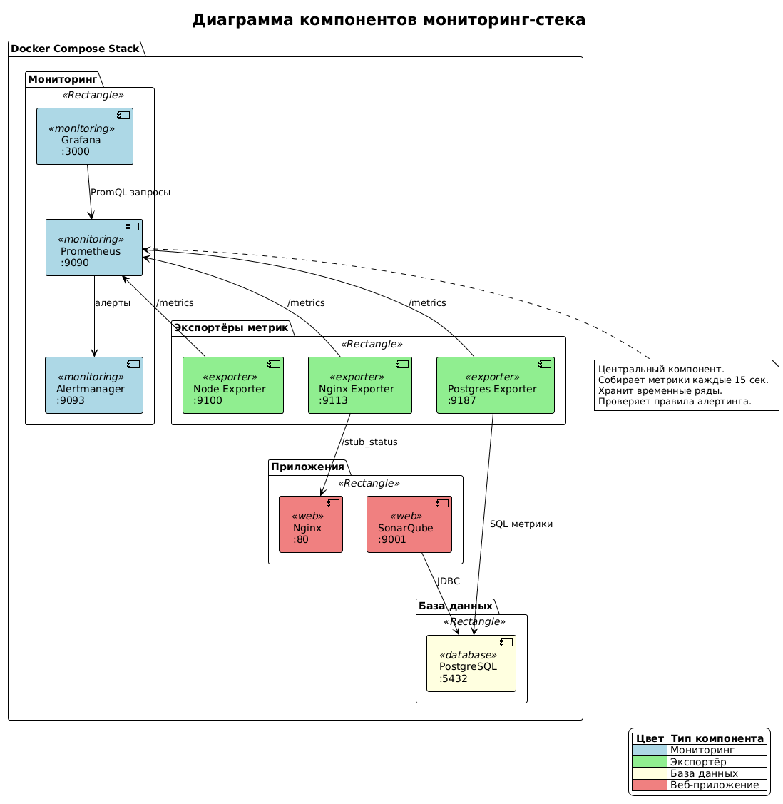
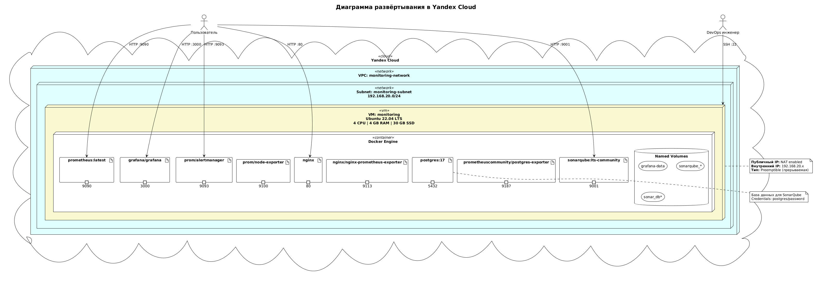
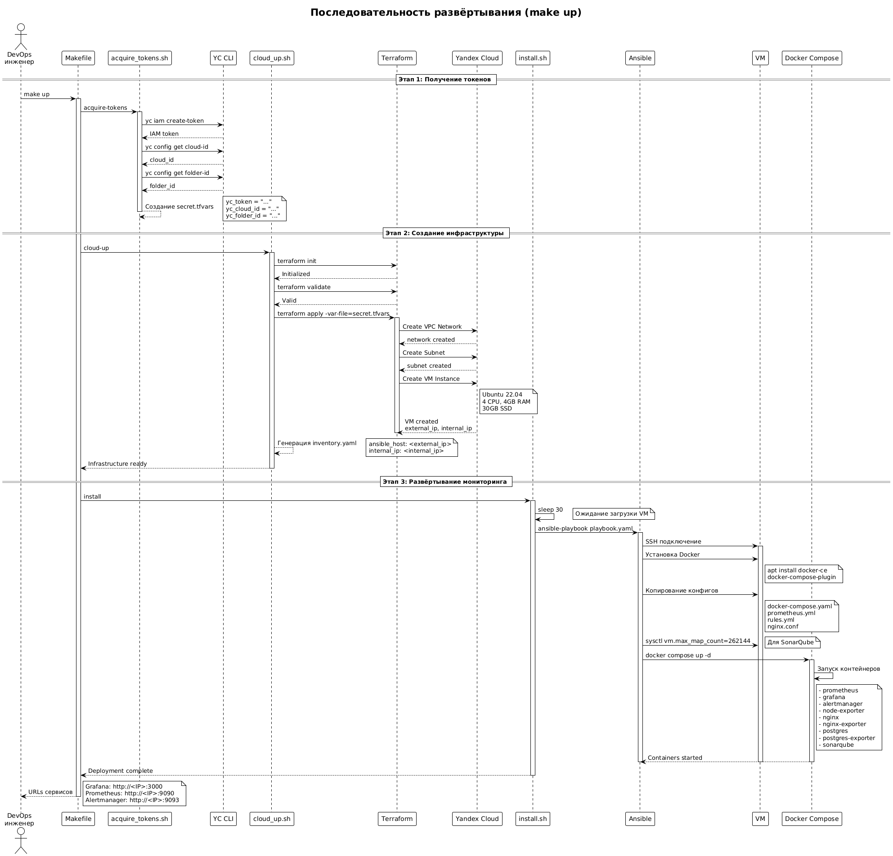

# Мониторинг-инфраструктура на Yandex Cloud

Проект разворачивает полный стек мониторинга на виртуальной машине в Yandex Cloud. Использует Terraform для создания облачной инфраструктуры и Ansible для развёртывания Docker-контейнеров с сервисами мониторинга.

## Содержание

- [Архитектура](#архитектура)
- [Требования](#требования)
- [Быстрый старт](#быстрый-старт)
- [Сервисы мониторинга](#сервисы-мониторинга)
- [Конфигурация](#конфигурация)
- [Доступ к сервисам](#доступ-к-сервисам)
- [Диаграммы](#диаграммы)

## Архитектура

Проект состоит из трёх слоёв:

### 1. Инфраструктурный слой (Terraform)

Terraform создаёт в Yandex Cloud:
- **VPC сеть** `monitoring-network` для изоляции ресурсов
- **Подсеть** `monitoring-subnet` с CIDR `192.168.20.0/24`
- **Виртуальная машина** `monitoring`:
  - ОС: Ubuntu 22.04 LTS
  - CPU: 4 ядра
  - RAM: 4 ГБ
  - Диск: 30 ГБ SSD
  - Тип: Preemptible (прерываемая) для снижения стоимости
  - Публичный IP через NAT

### 2. Слой управления конфигурацией (Ansible)

Ansible выполняет:
- Установку Docker и Docker Compose на VM
- Копирование конфигурационных файлов
- Запуск Docker Compose стека с сервисами мониторинга

### 3. Слой мониторинга (Docker Compose)

Docker Compose разворачивает:
- **Prometheus** — сбор и хранение метрик
- **Grafana** — визуализация метрик
- **Alertmanager** — управление алертами
- **Node Exporter** — метрики хоста (CPU, RAM, диск)
- **Nginx** + **Nginx Exporter** — веб-сервер с метриками
- **PostgreSQL** + **Postgres Exporter** — БД с метриками
- **SonarQube** — анализ качества кода

## Требования

| Компонент | Версия | Описание |
|-----------|--------|----------|
| Yandex Cloud CLI (`yc`) | latest | Должен быть авторизован (`yc init`) |
| Terraform | >= 0.13 | Для управления инфраструктурой |
| Ansible | latest | Для конфигурации VM |
| SSH ключ | Ed25519 | По умолчанию `~/.ssh/id_ed25519.pub` |

## Быстрый старт

### Полное развёртывание (рекомендуется)

```bash
# Создать инфраструктуру и развернуть мониторинг
make up
```

Эта команда:
1. Получит токены Yandex Cloud
2. Создаст VM в облаке через Terraform
3. Установит Docker на VM через Ansible
4. Запустит все сервисы мониторинга

### Поэтапное развёртывание

```bash
# 1. Получить токены YC (опционально, выполняется автоматически)
make acquire-tokens

# 2. Создать только облачную инфраструктуру
make cloud-up

# 3. Развернуть мониторинг на существующей VM
make install
```

### Удаление инфраструктуры

```bash
# Уничтожить все облачные ресурсы
make down
```

## Сервисы мониторинга

| Сервис | Порт | Описание | Учётные данные |
|--------|------|----------|----------------|
| **Grafana** | 3000 | Дашборды и визуализация метрик | `admin` / `admin` |
| **Prometheus** | 9090 | Сбор метрик, PromQL запросы | — |
| **Alertmanager** | 9093 | Маршрутизация алертов | — |
| **SonarQube** | 9001 | Анализ качества кода | `admin` / `admin` |
| **Nginx** | 80 | Веб-сервер | — |
| **Node Exporter** | 9100 | Метрики хоста | — |
| **Nginx Exporter** | 9113 | Метрики Nginx | — |
| **Postgres Exporter** | 9187 | Метрики PostgreSQL | — |
| **PostgreSQL** | 5432 | База данных | `postgres` / `password` |


## Конфигурация

### Terraform переменные

Файл `terraform/variables.tf`:

| Переменная | Описание | Значение по умолчанию |
|------------|----------|----------------------|
| `yc_token` | IAM токен Yandex Cloud | Из `secret.tfvars` |
| `yc_cloud_id` | ID облака | Из `secret.tfvars` |
| `yc_folder_id` | ID каталога | Из `secret.tfvars` |
| `yc_zone` | Зона доступности | `ru-central1-a` |
| `ubuntu_image_id` | ID образа Ubuntu | `fd8498pb5smsd5ch4gid` |
| `ssh_public_key_path` | Путь к SSH ключу | `~/.ssh/id_ed25519.pub` |

### Prometheus конфигурация

Файл `ansible/metrics/prometheus.yml`:

```yaml
global:
  scrape_interval: 15s      # Интервал сбора метрик
  scrape_timeout: 10s       # Таймаут запроса
  evaluation_interval: 15s  # Интервал проверки правил

scrape_configs:
  - job_name: 'prometheus'
    static_configs:
      - targets: ['localhost:9090']

  - job_name: 'node-exporter'
    static_configs:
      - targets: ['node-exporter:9100']

  - job_name: 'nginx-exporter'
    static_configs:
      - targets: ['nginx-exporter:9113']

  - job_name: 'postgres-exporter'
    static_configs:
      - targets: ['postgres-exporter:9187']
```

### Alerting правила

Файл `ansible/metrics/rules.yml`:

```yaml
groups:
  - name: Node
    interval: 15s
    rules:
      - alert: HighCPUUsage
        expr: 100 - avg(rate(node_cpu_seconds_total{mode="idle"}[5m])) * 100 > 0
        for: 5m
        labels:
          severity: critical
        annotations:
          summary: "Высокая загрузка CPU на {{ $labels.instance }}"
```


## Доступ к сервисам

После успешного развёртывания (`make up`) сервисы доступны по адресам:

```
Grafana:      http://<VM_IP>:3000    (admin/admin)
Prometheus:   http://<VM_IP>:9090
Alertmanager: http://<VM_IP>:9093
SonarQube:    http://<VM_IP>:9001    (admin/admin)
Nginx:        http://<VM_IP>:80
```

IP адрес VM выводится в конце выполнения `make up` или `make install`.

Также можно получить IP через Terraform:

```bash
cd terraform && terraform output external_ip
```

## Диаграммы

В папке `docs/diagrams/` находятся PlantUML диаграммы архитектуры:

Компоненты Docker стека и их взаимосвязи



Инфраструктура развёртывания в Yandex Cloud



Последовательность выполнения `make up`

